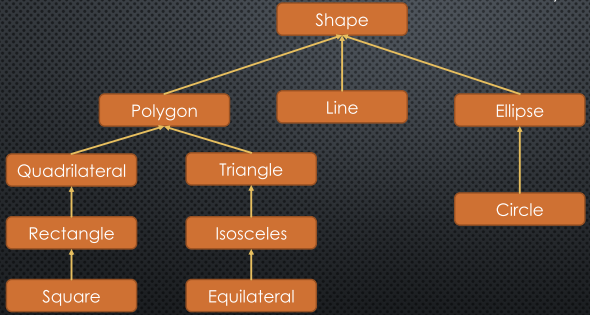
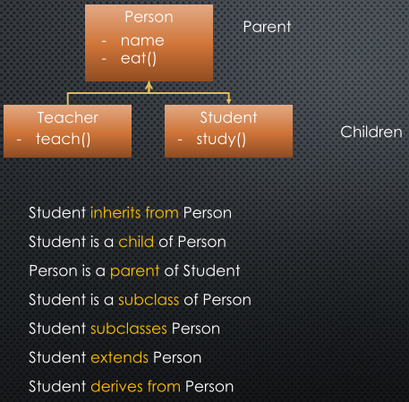
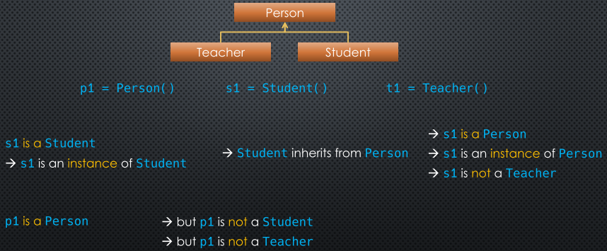
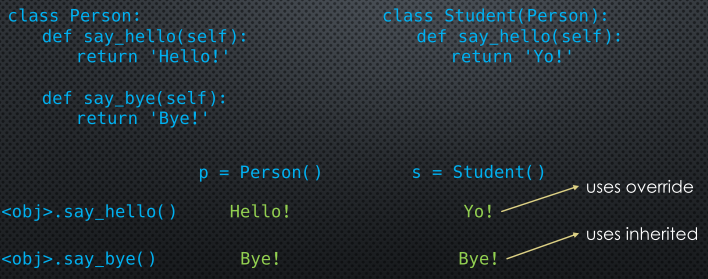
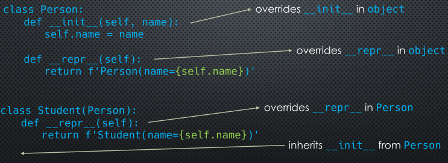

* [List đầy đủ](https://votatdat.github.io/Python/Python_list) 
<br>
<br>

## 01. Single Inheritance
Thừa kế (inheritance) là một khái niệm trong lập trình hướng đối tượng OOP.
<br>Trong class sẽ có các property và method và những điều này sẽ được thừa kế để tạo nên thứ bậc.

Chúng ta xem hình dưới:


Dấu mũi tên chỉ mối quan hệ `IS-A` (dịch đại khái: là một), chẳng hạn như `Circle` is a `Ellipse` (Cirlce là một Ellipse). Ngoài ra còn có mối quan hệ `has a` trong composition mà chúng ta chưa đề cập ở đây.
<br>Các property và method trong các clas có thể được `inherit` (thừa kế), `extend` (mở rộng) hoặc `override` (ghi đè, hình như chỗ khác dịch là nạp chồng), chúng ta sẽ tìm hiểu thêm ở các phần dưới.

Hình bên dưới là một vài thuật ngữ tiếng Anh, mình không dịch ra mà để nguyên.


Ở các ví dụ trên, một class con (children class, derived class) chỉ thừa kế lại duy nhất một class cha (parent class, base class), nên gọi là `single inheritance` (đơn thừa kế), thực tế còn có `multiple inheritance` (đa thừa kế) là class con thừa kế từ nhiều class cha, vấn đề này chúng ta chưa đề cập ở đây.


Ở hình trên, chúng ta thấy s1 là một Student hoặc s1 là một instance của Student, và do Student thừa kế từ Person nên s1 cũng là một Person, hay s1 cũng là một instance của Person, nhưng s1 không là Teacher.

Chúng ta nhắc lại về hàm `type()`, type(instance) sẽ trả về tên class của instance đó, chẳng hạn type(s1) sẽ trả về Student.
<br>Rõ ràng, hàm type() chỉ trả về class con tạo nên instace đó (là Student), chứ không trả về class cha (Person).
<br>Nhưng hàm `isintance()` sẽ trả về True nếu hỏi object đó có được tạo từ lớp cha hay không. Ví dụ:

```python
>>> class Person:
...
...     pass
...
>>> class Teacher(Person):
...     pass
...
>>> class Student(Person):
...     pass
...
>>> p1 = Person()
>>> t1 = Teacher()
>>> s1 = Student()
>>> type(t1)
<class '__main__.Teacher'>
>>> type(s1)
<class '__main__.Student'>
>>> isinstance(t1, Teacher)
True
>>> isinstance(t1, Person)
True
```

Ngoài ra còn hàm `issubclass()` để kiểm tra class này có phải subclass của class khác hay không, ví dụ:

```python
>>> class Person():
...     pass
...
>>> class Student(Person):
...     pass
...
>>> class CollegeStudent(Student):
...     pass
...
>>> issubclass(Student, Person)
True
>>> issubclass(CollegeStudent, Student)
True
>>> issubclass(CollegeStudent, Person)
True
```

Chúng ta thấy rằn khi định nghĩa một class trong Python, thì có vẻ như class không thừa kế từ class nào, chẳng hạn như class dưới:

```python
>>> class Person():
...     pass
...
```

Nhưng thực tế, mọi class đều thừa kế từ một class có tên `object`.

```python
>>> isinstance(Person, object)
True
>>>
```

## 02. Object class
Thực sư khi tạo một class, chúng ta sẽ thừa kế từ object, nhưng chúng ta có thể bỏ nó đi cho gọn:

```python
>>> class Person(object):
...     pass
...
```

Chính vì lí do trên, mà class nào tạo ra cũng thừa kế nhưng attribute và method có sẵn của object như: `__name__`, `__new__`, `__init__`, `__repr__`, `__hash__`, `__eq__`... Để coi object có sẵn những attribute gì, chúng ta dùng hàm `dir()`.

```python
>>> p = Person()
>>> p.__repr__
<method-wrapper '__repr__' of Person object at 0x0000012AAD348880>
>>> p.__hash__
<method-wrapper '__hash__' of Person object at 0x0000012AAD348880>
>>> p == p
True
```

```python
>>> dir(object)
['__class__', '__delattr__', '__dir__', '__doc__', '__eq__', 
'__format__', '__ge__', '__getattribute__', '__gt__', 
'__hash__', '__init__', '__init_subclass__', '__le__', 
'__lt__', '__ne__', '__new__', '__reduce__', '__reduce_ex__', 
'__repr__', '__setattr__', '__sizeof__', '__str__', '__subclasshook__']
```

Ở những phần trước, chúng ta cũng đã biết class có kiểu type, nhưng thực ra object, int, str, dict... đều có kiểu type, do đó chúng là những class và cũng phải thừa kế từ object.

```python
>>> type(Person)
<class 'type'>
>>> type(object)
<class 'type'>
>>> type(int)
<class 'type'>
>>> type(list)
<class 'type'>
>>> type(str)
<class 'type'>
>>> issubclass(int, object)
True
>>> issubclass(dict, object)
True
```

Tuy nhiên, không phải chỉ có class mà ngay cả function cũng thừa kế từ object.

```python
>>> def my_func():
...     pass
...
>>> import types
>>> types.FunctionType is type(my_func)
True
>>> issubclass(types.FunctionType, object)
True
>>> isinstance(my_func,  object)
True
>>> isinstance(my_func, types.FunctionType)
True
```

Khi chúng ta dùng `==` để so sánh 2 instance với nhau mà không cần viết `__eq__` là vì `__eq__` đã được viết trong object.

```python
>>> p1 = Person()
>>> p2 = Person()
>>> p1 is p2, p1 == p2, p1 is p1, p1 == p1
(False, False, True, True)
```

Và vì chúng ta không viết `__eq__` nên id của nó trong class và trong object là như nhau:

```python
>>> id(Person.__eq__)
1282805080848
>>> id(object.__eq__)
1282805080848
>>> id(Person.__init__) == id(object.__init__)
True
```

Tuy nhiên, khi chúng ta viết `__init__` trong class là chúng ta đã override nó, id sẽ thay đổi:

```python
>>> class Person:
...     def __init__(self):
...             pass
...
>>> id(Person.__init__) == id(object.__init__)
False
```

<br>
## 03. Overriding
Class con thừa kế các attribute và method ở class cha, nhưng chúng ta có thể định nghĩa lại các điều này ở class con, cái này gọi là `overriding`.



Ở trên, `say_hello()` đã được override ở class Student, còn `say_bye()` thì được thừa kế.
<br> Tương tự, chúng ta coi ví dụ dưới:



Chúng ta thấy rằng, trong class Person, `__init__()` và `__repr__` đã override các hàm này ở object, class Student thừa kế lại class Person, và override `__repr__` từ Person, đồng thời thừa kế lại `__init__`.

Lưu ý rằng:
- Object thì có property `__class__` trả lại class mà tạo ra object này.
- Class thì có property `__name__` trả lại một string chưa tên của class.

Giả sử chúng ta có đoạn code dưới:

```python
class Person:
	def __init__(self, name):
		self.name = name
	
	def __repr__(self):
		return f'Person(name={self.name})'
		

class Student(Person):
	def __repr__(self):
		return f'Student(name={self.name})'
```

Nó hơi dài dòng, chúng ta có thể viết lại cho gọn hơn:

```python
class Person:
	def __init__(self, name):
		self.name = name
	
	def __repr__(self):
		return f'{self.__class__.__name__}(name={self.name})'


class Student(Person):
	pass
```

Ở [phần 03](https://votatdat.github.io/Python/OOP03), chúng ta đã so sánh `__repr__` và `__str__`, chúng ta đã thấy rằng `__repr__` sử dụng được cho tất cả các hàm `print()`, `str()` và `repr()` lẫn gọi instance trực tiếp, còn `__str__` chỉ dùng được cho hàm `print()` và `str()`. Tới đây chúng ta đã giải thích được: bằng cách nào đó, `__repr__` đã thừa kế cách gọi hàm `print()` và `str()` từ `__str__` và được viết thêm cách gọi hàm `repr()`.

Chúng ta xem thêm ví dụ ở dưới, để cẩn thận hơn khi sử dụng override, các bạn có thể download `OOP06_override01.py` về [ở đây](./code/OOP06_override01.py)

```python
class Shape:
    def __init__(self, name):
        self.name = name
        
    def info(self):
         return f'Shape.info called for Shape({self.name})'
    
    def extended_info(self):
        return f'Shape.extended_info called for Shape({self.name})'
    
class Polygon(Shape):
    def __init__(self, name):
        self.name = name  # we'll come back to this later in the context of using the super()
        
    def info(self):
        return f'Polygon info called for Polygon({self.name})'
```

Chúng ta import file vào rồi chạy thử:

```python
>>> from OOP06_override01 import Shape, Polygon
>>> p = Polygon('square')
>>> p.info()
'Polygon info called for Polygon(square)'
>>> p.extended_info()
'Shape.extended_info called for Shape(square)'
```

Điều này cũng không có gì lạ, p là instance của Polygon, khi gọi `info()` thì method này được override ở class Polygon nên giá trị trả về phải từ method này.
<br>Còn khi gọi `extended_info()` thì chúng ta không viết method này trong Polygon nên Polygon thừa kế lại từ Shape.
<br>Câu hỏi là: nếu chúng ta gọi `info()` ở bên trong `extended_info()` thì method `info()` nào sẽ được gọi?

Chúng ta edit một chút, lưu lại tên mới `OOP06_override02.py`, các bạn có thể download [ở đây](./code/OOP06_override02.py)

```python
class Shape:
    def __init__(self, name):
        self.name = name
        
    def info(self):
         return f'Shape.info called for Shape({self.name})'
    
    def extended_info(self):
        return f'Shape.extended_info called for Shape({self.name})', self.info() # Thêm chút xíu ở đây
    
class Polygon(Shape):
    def __init__(self, name):
        self.name = name  # we'll come back to this later in the context of using the super()
        
    def info(self):
        return f'Polygon info called for Polygon({self.name})'
```

```python
>>> from OOP06_override02 import Shape, Polygon
>>> p = Polygon('square')
>>> p.info()
'Polygon info called for Polygon(square)'
>>> p.extended_info()
('Shape.extended_info called for Shape(square)', 'Polygon info called for Polygon(square)')
```

Chúng ta thấy rằng, `info()` vẫn được gọi từ class con, dù được gọi ở class cha.
Đây là điểm phải hết sức chú ý khi viết override, khi object là instance của class con thì self sẽ là class con dù method được gọi nằm ở class cha.


## 04. Extending
Chúng ta đã đề cập `inherit` và `override`, chúng ta còn có thêm `extend` nữa.
<br>
<br>
<br>
<br>
(Sẽ viết và cập nhật tiếp)
