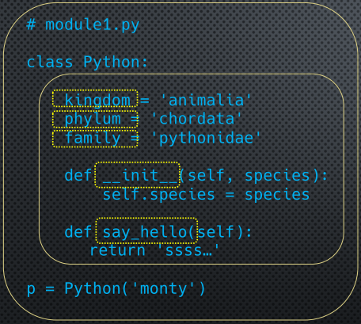
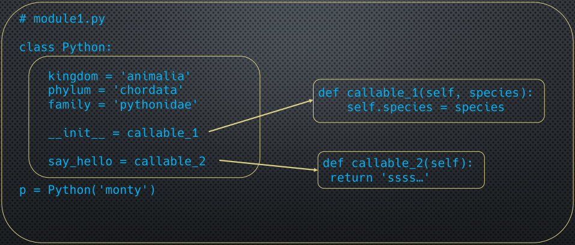

* [List đầy đủ](https://votatdat.github.io/Python/Python_list) 
 
 

## 07. Khởi tạo Class Instance
Khi chúng ta khởi tạo một class, thì Python mặc định sẽ làm 2 thứ:
1. Tạo một instance của class
2. Khởi tạo namespace cho class


>>> class MyClass:
...     language = 'Python'
...
>>> obj = MyClass()
>>> obj.__dict__
{}


Tuy nhiên, chúng ta có thể thay đổi điều này, không cần xài mặc định:


class MyClass:
	language = 'Python'
	
	def __init__(obj, version):
		obj.version = version
		

MyClass('3.7')


Khi chúng ta gọi MyClass('3.7'), Python sẽ tạo một instance với namespace hoàn toàn rỗng.
 Nếu chúng ta định nghĩa hàm `__init__` trong class:
- Class sẽ gọi `obj.__init__('3.7')`, tương đương với  `MyClass.__init__(obj, '3.7')`.
- Hàm này sẽ chạy và thêm `version` vào namespace của obj.
- `version` sẽ là instance, và `obj.__dict__` lúc này sẽ là  **{'version': '3.7'}**.
- Qui ước dùng `obj` ở trên bằng một object tên là **self**.

**Lưu ý:**
- Khi `__init__` được gọi, thì Python đã tạo xong object và namespace (rỗng) cho nó, sau đó `__init__` mới được gọi như là một method bị cột vào instance mới được tạo.
- Chúng ta có thể sử dụng một function để tạo object, đó là `__new__`.
- `__init__` không tạo object, nó chỉ chạy sau khi instance đã được tạo.

## 08. Tạo Attribute tại run-time
Chúng ta coi ví dụ dưới:


>>> class MyClass:
...     language = 'Python'
...
>>> obj = MyClass()
>>> obj.__dict__
{}
>>> obj.version = '3.7'
>>> obj.__dict__
{'version': '3.7'}


Chuyện gì xảy ra khi chúng ta gán như sau: **obj.say_hello = lambda: 'Hello World!'** ?


>>> obj.say_hello = lambda: 'Hello World!'
>>> obj.say_hello
<function <lambda> at 0x00000235F18889D0>
>>> obj.say_hello()
'Hello World!'
>>> obj.__dict__
{'version': '3.7', 'say_hello': <function <lambda> at 0x00000235F18889D0>}


Nhưng hàm lambda này là `function`, không phải `bound method`.

Chúng ta có thể tạo method lúc run-time và cột nó vào một instance, dùng `MethodType` **MethodType(function, object)**:


>>> obj.say_hello = MethodType(lambda self: f'Hello {self.language}!', obj)
>>> obj.__dict__
{'version': '3.7', 'say_hello': <bound method <lambda> of <__main__.MyClass object at 0x00000235F17D0AF0>>}


## 09. Property
Chúng ta hiểu property như private, public của một attribute. Ở Python sẽ hơi khác một chút.


>>> class MyClass:
...     def __init__(self, language):
...             self.language = language
...
>>>
>>> obj = MyClass('Python')
>>> obj.language
'Python'
>>> obj.language = 'Java'
>>> obj.language
'Java'


Ở ví dụ trên, chúng ta có thể thấy rằng chúng ta truy xuất các Attribute rất dễ dàng, nhưng ở các ngôn ngữ lập trình khác, điều này không được khuyến khích.
 Ở các ngôn ngữ này, có qui ước để attribute bí mật (private), tức là bên ngoài không truy xuất được trực tiếp, phải gọi và set thông qua hàm `getter` và `setter`.
 Tuy ở Python, không có private attribute nhưng chúng ta có thể viết như ở dưới:


class MyClass:
	def __init__(self, language):
		self._language = language
	
	def get_language(self):
		return self._language
	
	def set_language(self, value):
		self._language = value 


Chúng ta chỉ có thể truy xuất hoặc gán giá trị mới thông qua 2 method trên:


obj.get_language()

obj.set_language('Java')


Nếu bắt đầu chúng ta viết class cho phép truy xuất trực tiếp, sau đó vì lý do gì đó cần chuyển truy xuất gián tiếp qua hàm, chúng ta sẽ phải thay đổi toàn bộ **obj.language = 'Java'** thành **obj.set_language('Java')**.

Python có một giải pháp, đó là sử dụng `property` class. Chúng ta xem ví dụ ở dưới:


>>> class MyClass:
...     def __init__(self, language):
...             self._language = language
...     def get_language(self):
...             return self._language
...     def set_language(self, value):
...             self._language = value
...     language = property(fget=get_language, fset=set_language)
...
>>> m = MyClass('Python')
>>> m.language
'Python'
>>> m.language = 'Java'
>>> m.language
'Java'


**`property` là một class, có các parameter sau:**
- fget: input là tên hàm getter
- fset: input là tên hàm setter
- fdel: input là tên hàm deleter
- doc: hiển thị docstring cho property

Lưu ý: trong dictionary của object m vẫn lưu **\_language** không phải **language**.


>>> m.__dict__
{'_language': 'Python'}


## 10. Property Decorator
`property` có thể được khởi tạo bằng nhiều cách khác nhau:


x = property(fget=get_x, fset=set_x)
# Hoặc:
x = property()
x = x.getter(get_x)
x = x.setter(set_x)
# Hoặc:
x = property(get_x)
x = x.setter(set_x)


Chúng ta có thể decorate lại như ở dưới: 


class MyClass:
	def __init__(self, language):
		self._language = language

	def language(self):
		return self._language

	language = property(language)


Hoặc chúng ta có thể viết lại như ở dưới:


class MyClass:
	def __init__(self, language):
		self._language = language
	
	@property
	def language(self):
		return self._language


Tuy nhiên, ở trên mới chỉ có getter, chúng ta phải thêm setter nữa.


class MyClass:
	def __init__(self, language):
		self._language = language
	
	@property
	def language(self):
		return self._language

	def set_language(self, value):
		self._language = value
	
	language = language.setter(set_language)


Hoặc chúng ta có thể viết lại như ở dưới:


class MyClass:
	def __init__(self, language):
		self._language = language
	
	@property
	def language(self):
		return self._language
		
	@language.setter
	def language(self, value):
		self._language = value


Lưu ý: với cách viết sau thì tên hàm dưới `@property` và dưới `@language.setter` phải hoàn toàn giống nhau (ở đây là language).

## 11. Read-Only and Computed Properties
Để tạo read-only property thì chúng ta phải tạo một attribute sao cho chỉ có getter mà thôi (nhưng thực sự cũng không hoàn toàn read-only).
 Chúng ta hãy xem 2 ví dụ dưới:


>>> import math
>>> class Circle:
...     def __init__(self, r):
...             self.r = r
...     def area(self):
...             return math.pi * self.r * self.r
...
>>> c = Circle(1)
>>> c.area()
3.141592653589793



>>> import math
>>> class Circle:
...     def __init__(self, r):
...             self.r = r
...     @property
...     def area(self):
...             return math.pi * self.r * self.r
...
>>> c = Circle(1)
>>> c.area
3.141592653589793


Lưu ý, ở ví dụ trên chúng ta sử dụng area() như method, còn ở dưới chúng ta chỉ gọi c.area như gọi property của một class.
 Ở đây, area được gọi là `computed property`, đối với `lazy computation` thì area chỉ được tính toán lại khi có yêu cầu, do đó nó sẽ có giá trị trong bộ nhớ đệm gọi là `cache value`, nếu ai đó thay đổi `radius` thì chúng ta cần phải xóa `cache`.


class Circle:
	def __init__(self, r):
		self._r = r
		self._area = None #Xóa cache của area
		
	@property
	def radius(self):
		return self._r
	
	@radius.setter
	def radius(self, r):
		if r < 0:
			raise ValueError('Radius must be non-negative')
		self._r = r
		self._area = None
	
	@property
	def area(self):
		if self._area is None: # Chỉ tính area khi cache của area là None
			self._area = math.pi * (self.radius ** 2)
		return self._area


## 12. Deleting Properties
Để xóa property thì chúng ta có thể sử dụng từ khóa `del` hoặc hàm `delattr`.


>>> c.color = 'yellow'
>>> c.color
'yellow'
>>> del c.color
>>> c.color
Traceback (most recent call last):
  File "<stdin>", line 1, in <module>
AttributeError: 'Circle' object has no attribute 'color'
>>> 
>>> c.color = 'green'
>>> c.color
'green'
>>> delattr(c, 'color')
>>> c.color
Traceback (most recent call last):
  File "<stdin>", line 1, in <module>
AttributeError: 'Circle' object has no attribute 'color'


Tuy nhiên, Python cũng hỗ trợ deleter, tượng tự như setter và getter, code ví dụ ở dưới gồm 2 phiên bản:


class Circle:
	def __init__(self, color):
		self._color = color
	
	def get_color(self):
		return self._color
	
	def set_color(self, value):
		self._color = value
	
	def del_color(self):
		del self._color
	
	color = property(get_color, set_color, del_color)
	

c = Color('yellow')
c.color # Kết quả: 'yellow'
c.__dict__ # Kết quả: {'_color': 'yellow'}
del c.color 
c.__dict__ # Kết quả: {}
c.color # Kết quả: AttributeError
c._color # Kết quả: AttributeError



class UnitCircle:
	def __init__(self, color):
		self._color = color
	
	@property
	def color(self):
		eturn self._color
	
	@color.setter
	def color(self, value):
		self._color = value
	
	@color.deleter
	def color(self):
		del self._color


## 13. Static method
Chúng ta coi lại một ví dụ cũ:


>>> class MyClass:
...     def hello():
...             return 'Hello'
...
>>> MyClass.hello # Đây là plain function của MyClass.
<function MyClass.hello at 0x0000029543638A60>
>>> MyClass.hello()
'Hello'
>>>
>>> m = MyClass()
>>> m.hello # Đây là instance method bị cột vào instance m
<bound method MyClass.hello of <__main__.MyClass object at 0x0000029543580AF0>>
>>> m.hello()
Traceback (most recent call last):
  File "<stdin>", line 1, in <module>
TypeError: hello() takes 0 positional arguments but 1 was given


Chúng ta thấy rằng, MyClass.hello là `function`, hay là một method bị cột với MyClass.
 Còn m.hello là `bound method`, nghĩa là, nó là một method bị cột vào với m, là một instance.
 Câu hỏi là: có cách nào làm cho method ở trong class bị cột vào chính class đó mà không bị cột vào với instance nào không?
 Câu trả lời là: **@classmedthod**. Chúng ta hãy xem ví dụ ở dưới:


class MyClass:
	def hello():
		print('hello…')
	
	def inst_hello(self):
		print(f'hello from {self}')
	
	@classmethod
	def cls_hello(cls):
		print(f'hello from {cls}') 


 `hello` ở trong MyClass là một regular function, khi tạo instance, nó bị cột vào instance đó, gọi sẽ báo lỗi vì thiếu argument.
 `inst_hello` ở trong MyClass là cũng là một regular function, khi tạo instance, nó bị cột vào instance đó, gọi sẽ không báo lỗi vì đã có argument.
 `cls_hello` ở trong MyClass là một method bị cột vào MyClass, kể cả khi tạo instance nó cũng bị cột vào class này.

Ở trên, `cls_hello` là một method bị cột vào chính class của mình, chứ không bị cột vào bất kì instance nào.
 Câu hỏi là: có thể làm cách nào mà method không bị cột vào bất cứ object nào không, kể cả class của chính nó?
 Câu trả lời là: **@staticmedthod**. Chúng ta hãy xem ví dụ ở dưới:


>>> class Circle:
...     @staticmethod
...     def help():
...             return 'help available'
...
>>> type(Circle.help)
<class 'function'>
>>> Circle.help
<function Circle.help at 0x0000029543638B80>
>>> Circle.help()
'help available'
>>> c = Circle()
>>> type(c.help)
<class 'function'>
>>> c.help()
'help available'


Chúng ta thấy help() luôn luôn là `function` dù ở trong class Circle hay sau khi bị gán với instance c.
 Chúng ta xem ví dụ dưới để so sánh:


class MyClass:
	def inst_hello(self):
		print(f'hello from {self}')
	
	@classmethod
	def cls_hello(cls):
		print(f'hello from {cls}') 
	
	@staticmethod
	def static_hello():
		print('static hello')


Ở trên, `inst_hello` là một method bị cột vào instance khi instance được gọi.
 `cls_hello` luôn luôn bị cột vào MyClass, không bị cột vào instance, điều này tương đương với việc `cls_hello` luôn nhận MyClass là argument đầu tiên.
 `static_hello` là một static method, không bị cột vào bất cứ thứ gì, và không cần thêm bất cứ argument nào.
 Static method được sử dụng khi có một function nào đó nằm trong class, nhưng chúng ta cần hàm đó không thay đổi dù class bị gán cho bất cứ object nào.

Ví du: Timer
 start(self): instance method
 end(self): instance method
 timezone: class attribute -> cho phép chúng ta thay đổi timezone với mọi instance 
 current_time_utc(): static method
 current_time(cls): class method (needs class time zone)

## 14. Một vài kiểu dữ liệu của Python
Một vài kiểu dữ liệu chúng ta hay dùng trong Python như int, str, list, tuple... là kiểu dựng sẵn (built-in). Ví dụ:


>>> l = [1, 2, 3]
>>> type(l)
<class 'list'>
>>> isinstance(l, list)
True


Nhưng có vài kiểu, không phải là dựng sẵn: function, module, generator.... 
 Chúng ta sử dụng `types` module để check:


>>> def my_func():
...     pass
...
>>> type(my_func)
<class 'function'>
>>> isinstance(my_func, function)
Traceback (most recent call last):
  File "<stdin>", line 1, in <module>
NameError: name 'function' is not defined
>>> import types
>>> type(my_func) is types.FunctionType
True
>>> isinstance(my_func, types.FunctionType)
True


Ngoài `types.FunctionType` còn có `types.ModuleType`, `types.GeneratorType`... để check kiểu dữ liệu.

## 15. Scope
Mỗi module, class hay function đều có một phạm vi nhất định, nó là `scope`.

Chúng ta xem hình dưới:

`Module`: có scope global, chứa class Python lẫn object p.
 `class` có scope của chính nó, chứa  kingdom, phylum , family , \_\_init\_\_, say_hello
 Vậy scope của method được định nghĩa trong class thì thế nào? Có nằm trong class đó không? 
 Thực ra scope của method nằm ngoài class đó, chỉ có cái tên của method (gọi là `symbol`) nằm trong class đó thôi.
 Chúng ta xem hình dưới để dễ hình dung:

Chúng ta xem ví dụ dưới:


class Account:
	COMP_FREQ = 12
	APR = 0.02  # 2%
	APY = (1 + APR/COMP_FREQ) ** COMP_FREQ - 1 
	# cái này OK, vì APR và COMP_FREQ là những symbol nằm cùng class, cùng namespace
	
	def __init__(self, balance):
		self.balance = balance
		
	def monthly_interest(self):
		return self.balance * self.APY
		# cái này OK, vì chúng ta sử dụng self.APY
	
	@classmethod
	def monthly_interest_2(cls, amount):
		return amount * cls.APY
		# cái này OK, vì chúng ta sử dụng cls.APY
		
	@staticmethod
	def monthly_interest_3(amount):
		return amount * Account.APY
		# cái này OK, vì chúng ta sử dụng Account.APY
		
	def monthly_interest_3(self):
		return self.amount * APY
		# cái này fail, vì APY không được khai báo trong method này,
		# mà method này chỉ có symbol nằm trong class thôi,
		# thực thể method này nằm ngoài class
	


Phần giới thiệu sâu thêm về class và object đến đây là hết. [Phần 03](https://votatdat.github.io/Python/OOP03) sẽ giới thiệu về Polymorphism (đa hình) và các method đặc biệt.